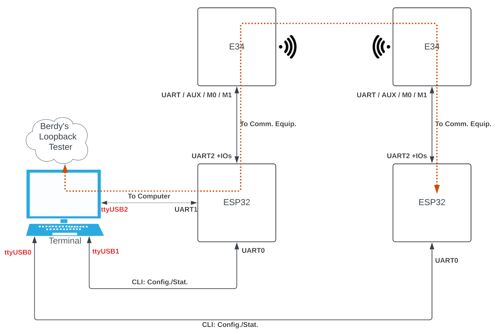

# Ebyte-module Flow Controller with TTGO-T-Beam

Flow controller takes responsibility for managing data flowing in and out 
    between Ebyte module (E34), as a communication equipment, and the terminal equipment, e.g. a computer.
Due to the fact that the module is limitted in memory buffer, 
    normally the payload cannot be sent over than 255 bytes in single time.

## Let's Get Started

### Experiment Setting

### Connect T-Beam with EByte Module

* [T-Beam].4  (RXD1) to [Term].Tx
* [T-Beam].23 (TXD1) to [Term].Rx

* [T-Beam].13 (RXD2) to [Ebyte].Tx
* [T-Beam].2  (TXD2) to [EByte].Rx
* [T-Beam].34 (GPIO) to [Ebyte].AUX
* [T-Beam].25 (GPIO) to [EByte].M0
* [T-Beam].14 (GPIO) to [Ebyte].M1

* [T-Beam].GND        
* [T-Beam].5V        

### Firmware Installation

x

### How Firmware Work

x

### Running Script for the Test

x

## Resources

### Hardware References

* [All versions' schematics](https://github.com/Xinyuan-LilyGO/LilyGO-T-Beam)
* [V0.7 information](https://tinymicros.com/wiki/TTGO_T-Beam)

* [LiLy TTGO T-Beam 0.7](http://www.lilygo.cn/prod_view.aspx?TypeId=50033&Id=1237&FId=t3:50033:3)
* [LiLy TTGO T-Beam 1.1](http://www.lilygo.cn/claprod_view.aspx?TypeId=62&Id=1281&FId=t28:62:28)

* [SoftRF](https://github.com/lyusupov/SoftRF/wiki/Prime-Edition-MkII)

* TTGO-T-Beam Rev.0.7 Pinout

* TTGO-T-Beam Rev.1.0 Pinout

* TTGO-T-Beam Rev.1.1 Pinout

### Examples

* [Examples for each peripheral on T-Beam](https://github.com/Xinyuan-LilyGO/LilyGo-LoRa-Series)
